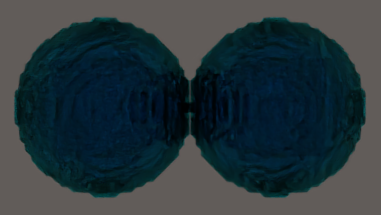
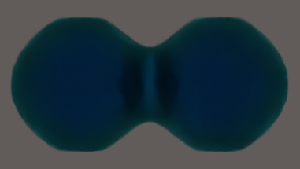
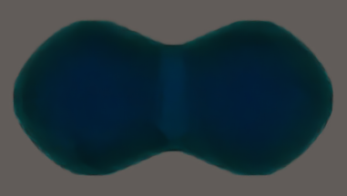

# PFS - Experimental C++/CUDA Phase-Fields Solver - in development

## Description
This is a preliminary and experimental CUDA port of the code SLOTH from the CEA (French Nuclear Agency)  
Note: This is an INDEPENDANT port, the author of this port is NOT affiliated with the CEA

## Key Concepts
For now only the Cahn-Hilliard part is done (see 3d test below).
The port is one GPU for now, and can be extended to CUDA-aware MPI for multiple GPUs.

## Remarks
- Other functionalities can be implemented following the same logic
- Multiple GPUs implementation coulb be implmeented soon, if enough people demand it
- Code will be given only on demand
- This code is based on SLOTH, see: https://github.com/Collab4Sloth/SLOTH for the repository of the original code, license and authors

## Supported OS
Tested on Ubuntu 24.04

## Prerequisites
Tested with Nvidia RTX 4000 laptop

### - Extracts of simulation (Cahn-Hilliard) - Two bubbles in dimension 3

#### Grid with 1 061 208 dofs, with a laptop card RTX4070, simulation setup in fp32. Note: fp64 and fp32 implemented, fp32 is used here as it runs much faster on this type of card, and fp64 would be too large. With T=5.0, dt=0.05, I get a computation time of about an hour):

